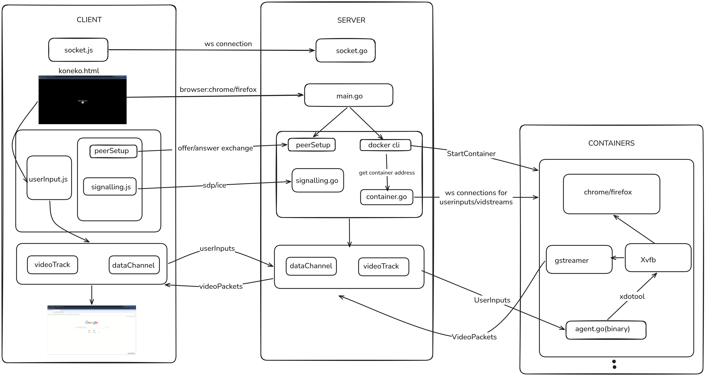

# Koneko

## A Golang based Remote Browser Isolation (RBI) system, designed to analyze and minimize latency bottlenecks in video streaming

Koneko explores different architectural strategies to implement a RBI system that is optimal in both latency and resource usage built primarily as a systems experiment to understand where latency actually comes from in modern RBI systems. The system has four core components:

---

### Client

A lightweight frontend with a dedicated JavaScript controller. The controller captures user inputs (keyboard/mouse/clicks) and forwards them to the server, while simultaneously receiving and rendering video packets via WebRTC DataChannels in an HTML video element.

---

### Containers

Contains custom Docker images supporting chrome/firefox instances. High-performance video encoding is embedded directly within these images (using GStreamer).

---

### Server

The Go-based orchestration layer and the heart of Koneko. This server manages the entire session lifecycle i.e., spinning up Docker containers, bridging input signals from the client to the browser instance, and routing compressed video packets back to the client.

---

### Benchmark

A specialized Go-based tool that mimics a high-frequency client. It stresses the system by flooding inputs to measure critical metrics like injection latency, memory used, CPU load, etc. This is a crucial tool to analyze the cause of bottlenecks in the system.


## System Architecture

  
*A high-level overview of the Koneko Remote Browser Isolation (RBI) flow.*

Koneko's architecture is divided into three main parts: the **Client**, the **Server**, and the isolated **Containers**.

---

### 1. Parallel WebRTC & Container Setup

When a user requests a session, the system executes two processes simultaneously in different routines:

- **WebRTC Setup:**  
  A temporary WebSocket connection is established purely for signaling. It handles the initial WebRTC handshake (SDP offers/answers and ICE candidate exchange).

- **Container Orchestration:**  
  In parallel, the server uses the Docker CLI to select the appropriate image based on the requested browser (Chrome or Firefox) and spins up an isolated container.

---

### 2. The Client (User Browser)

The user interacts with the system through `koneko.html`.

- **WebSocket Cleanup:**  
  Once `peerSetup` is complete and the WebRTC **DataChannel** and **VideoTrack** are successfully formed, the initial signaling WebSocket is intentionally dropped.

- **P2P Transport:**  
  `userInput.js` captures local mouse and keyboard events, sending them over the established DataChannel.  
  Simultaneously, the incoming video stream from the remote browser running in the container is rendered via the VideoTrack.

---

### 3. The Server (Orchestrator)

The Go-based backend acts as the bridge between the client and the isolated environment.

- **Persistent Internal Connections:**  
  To proxy data between the WebRTC peer connection and the container, the server maintains two persistent WebSocket connections:
  - One dedicated to receiving the video capture stream  
  - One for forwarding user inputs  

---

### 4. The Containers (Isolated Environment)

Each session creates a container based on the selected browser.

- **The Display Layer:**  
  The browser runs headlessly on top of **Xvfb** (X virtual framebuffer), which simulates a physical display.

- **Input Injection:**  
  The compiled Go binary, `agent.go`, receives raw input coordinates and keystrokes via the server's input-forwarding WebSocket.  
  It uses `xdotool` to translate and inject these inputs directly into the Xvfb display by spawning processes (`exec("xdotool", ...)`).

- **Video Pipeline:**  
  The virtual display is continuously captured and encoded by **GStreamer**.  
  This output is captured directly by the second persistent WebSocket and written to the server's VideoTrack to be streamed back to the client.

---

## Tech Stack

- Go (server + benchmark tooling)
- JavaScript (Inputcapturing and forwarding)
- WebRTC
- Docker
- Xvfb
- GStreamer
- Chrome / Firefox
- WebSockets 

---

## Running Koneko Locally

### Prerequisites
Ensure you have the following installed on your host machine:

- **Go** (version 1.24.5 or higher)  
- **Docker** (Docker daemon must be running)  
- **xdotool** (required for user-input injection)

---

### 1. Clone the repository

```bash
git clone https://github.com/yourusername/koneko.git
cd koneko
```

---

### 2. Build the Browser Containers

Before the server can orchestrate sessions, build the custom Docker images that contain the browsers and encoding logic.

```bash
cd containers

# Build Chrome image
docker build -t koneko-chrome -f Dockerfile.chrome .

# Build Firefox image 
docker build -t koneko-firefox -f Dockerfile.firefox .

cd ..
```

---

### 3. Install Server Dependencies

Navigate to the server directory and download required Go modules.

```bash
cd server
go mod tidy
```

---

### 4. Start the Koneko Server

Run the Go orchestration server.  
Make sure Docker is running so the server can spin up containers.

```bash
go run .
```

---

### 5. Access the Client

Open your browser and go to:

```
https://localhost:8080
```

**Note:**  
WebRTC requires a secure context. Since this runs locally using HTTPS with self-signed certificates, your browser will show an **“untrusted certificate”** warning — you will need to bypass/accept it to proceed.


## Work in Progress / Changes to be made

This project is still ongoing. The future roadmap can be divided into three phases addressing architectural constraints, system bottlenecks, and encoding efficiency.

---

### Phase 1: Refactoring Architecture

1. **Server Structure**  
   I am still in the middle of understanding/learning how Go servers should be structured, and that reflects in my current server directory (everything is in the `main` package). I plan to refactor the server directory to better align with standard Go project layouts.

2. **Cross-Platform Container Builds**  
   Currently, the `agent.go` binary is pre-compiled for a specific Linux architecture (`GOOS=linux GOARCH=amd64`).  
   This breaks cross-platform compatibility and can force Docker into using slow CPU emulation on different machines.  
   To fix this, I plan to implement multi-stage Docker builds so the agent compiles dynamically for the host’s native CPU architecture during the image build process.

3. **Automated Builds & Image Versioning**  
   Right now the Docker build process is handled pretty naively. Users have to manually run `docker build` commands, and there is no guarantee the built image version will match what the server expects.  
   I have currently hardcoded the specific image version I have working into the Go server, which is definitely bad practice.  
   I plan to handle this properly by introducing environment variables for dynamic image tagging and automating the build/run setup (likely using a `Makefile` or Docker Compose).

---

### Phase 2: Feature Addition and Low-level Optimization

This phase focuses on core bottlenecks while keeping encoder overhead constant.

1. **Direct X11 Instructions**  
   In the current version, all user input handling relies on spawning external `xdotool` processes — meaning roughly one process every ~16 ms (for a 60 FPS stream).  
   I plan to replace this with direct X11 calls via Go bindings (`xgb`) or a C bridge.

2. **Container Pooling & Session Management**  
   Currently, Koneko spins up a cold Docker container for every new session.  
   I plan to introduce storing session information (likely through Docker volumes) and maintaining a pool of pre-initialized containers to drastically reduce cold-start latency.

3. **Audio Integration**  
   Since Koneko’s main objective so far has been analyzing bottlenecks in the video stream, I didn’t initially consider adding audio a necessity.  
   Audio streaming will be added as well.

---

### Phase 3: Major Optimizations

1. **Encoding Optimizations**  
   Koneko aims to become optimal in both latency and resource usage. Addressing encoding overhead is necessary for this.  
   The system will eventually shift toward hardware-accelerated (GPU) encoding and a content-aware encoder that can encode differently based on ROI (Region of Interest).  
   (More details will be added when implementation begins.)

2. **Remote Deployment & Real-world Simulation**   
   Deploy to a remote VPS to simulate real-world WAN latency and bandwidth constraints.
